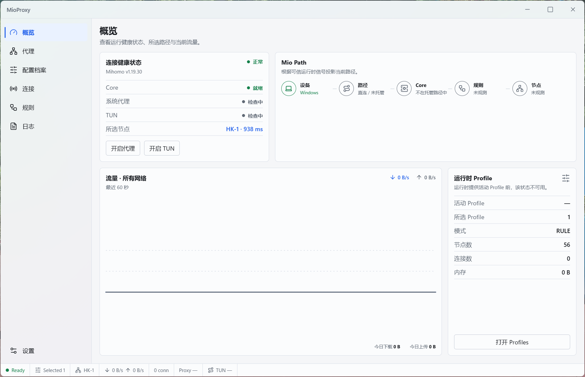
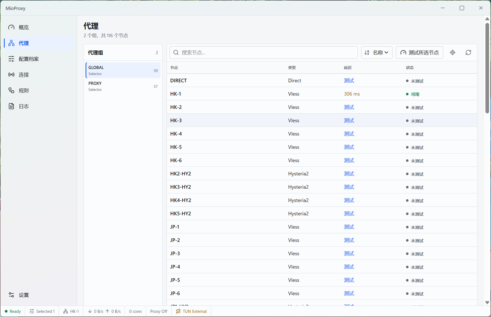
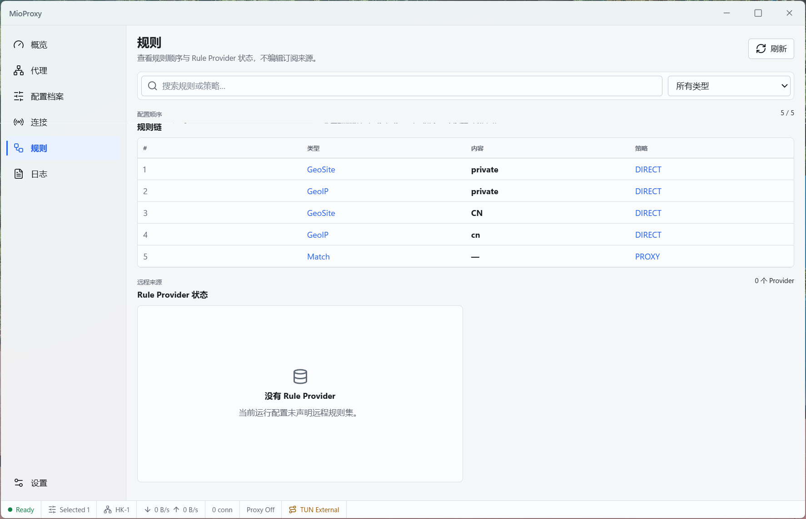

<div align="center">

# MioProxy

**A modern Windows proxy client powered by Mihomo.**

Subscriptions · Proxy Groups · System Proxy · TUN · Rules · Traffic · Secure Updates

[](https://github.com/Felyx-Fu/MioProxy/releases/latest)
[](https://github.com/Felyx-Fu/MioProxy)
[](LICENSE)
[](https://tauri.app/)
[](https://www.rust-lang.org/)

[Download](https://github.com/Felyx-Fu/MioProxy/releases/latest) · [Releases](https://github.com/Felyx-Fu/MioProxy/releases) · [Issues](https://github.com/Felyx-Fu/MioProxy/issues)

</div>

## Preview

MioProxy is a focused Windows desktop client for managing a Mihomo-powered
proxy runtime. Add a subscription, choose the route that fits the moment, and
see what is happening through one clear interface for profiles, proxies,
rules, traffic, connections, and logs.

<p align="center">
  
</p>

## Features

- **Mihomo-managed core** — MioProxy manages a separate Mihomo core and keeps
  its runtime state behind the application and Windows Service boundary.
- **Subscriptions and profiles** — Add, update, and apply subscription profiles from the desktop UI.
- **Proxy groups and node selection** — Inspect groups, switch nodes, and
  choose the active route without leaving the application.
- **Latency testing** — Test node reachability and compare latency when
  selecting a route.
- **System Proxy** — Enable or disable Windows System Proxy from MioProxy.
- **TUN** — Use Mihomo TUN mode when application-wide traffic handling is
  needed.
- **Rules, GeoSite, and GeoIP** — Work with rule modes and geodata-backed
  routing controls.
- **Connections, traffic, and logs** — Inspect active connections, traffic
  flow, runtime logs, and recent activity.
- **Windows desktop integration** — Use a native Tauri window, tray controls,
  Windows Service integration, and a desktop-oriented settings flow.
- **Secure updates** — Tauri updater artifacts and metadata are protected by
  cryptographic signatures that the updater verifies before applying an update.

## Download

Download the latest Windows x86_64 build from
[GitHub Releases](https://github.com/Felyx-Fu/MioProxy/releases/latest).

Windows may display **“Unknown publisher”** for the installer because MioProxy
does not currently use Windows Authenticode code signing. This is separate from
Tauri updater cryptographic signatures: updater artifacts are verified with the
Tauri updater public key, while Windows publisher identity is controlled by
Authenticode certificates.

## Quick Start

1. Install MioProxy.
2. Add a subscription or Profile.
3. Apply it.
4. Select a node.
5. Enable **System Proxy** or **TUN**.

## Screenshots

<p align="center">
  
  
</p>

## Why MioProxy

MioProxy keeps everyday proxy controls close at hand while leaving the
Mihomo core to do the routing work it is built for. The UI is organized around
the tasks users actually perform: add a source, select a route, inspect live
traffic, and understand what the runtime is doing.

The Windows Service provides a clear privilege boundary for managed runtime
operations. System Proxy and TUN changes are ownership-aware, and recovery
paths are designed to avoid silently taking over externally managed network
state.

## Architecture

```text
React / TypeScript
       ↓
Tauri / Rust
       ↓
MioProxy Windows Service
       ↓
Managed Mihomo Core
       ↓
Windows Network
```

The normal-user GUI communicates with the Windows Service through authenticated
IPC. The Service owns the managed Mihomo lifecycle, runtime configuration, and
managed network transitions; the core remains a separate Mihomo process.

## Development

### Prerequisites

- Node.js 20 or newer
- Rust stable with the MSVC Windows target
- Microsoft C++ Build Tools or Visual Studio Build Tools
- WebView2 Runtime

### Run locally

From the repository root:

```powershell
npm ci
npm run mihomo:setup
npm run service:build
npm run tauri dev
```

`mihomo:setup` downloads the repository-pinned Mihomo release, verifies its
SHA-256 digest, and prepares the Windows sidecar used by the application.

### Validate changes

```powershell
npm run build
npm run test:ui
cargo fmt --manifest-path .\src-tauri\Cargo.toml -- --check
cargo check --locked --manifest-path .\src-tauri\Cargo.toml
cargo test --locked --manifest-path .\src-tauri\Cargo.toml
cargo clippy --locked --manifest-path .\src-tauri\Cargo.toml --all-targets --all-features -- -D warnings
```

The source checks above do not replace real Windows acceptance testing for
taskbar, tray, DPI, TUN, System Proxy, and external-network behavior.

## Security & Release Integrity

- **Updater verification:** Tauri updater signatures are generated in the
  protected release workflow and verified against the public key configured in
  [`src-tauri/tauri.conf.json`](src-tauri/tauri.conf.json).
- **Artifact provenance:** Windows release checks record SHA-256 values for
  shipped executables, verify the pinned Mihomo input, enforce version
  consistency, and test updater metadata and tamper detection. See
  [`docs/release-trust.md`](docs/release-trust.md) for the detailed release
  record.
- **Dependency review:** The production dependency audit is kept separate from
  development-tool findings; the current triage is documented in
  [`docs/npm-audit-triage.md`](docs/npm-audit-triage.md).
- **Windows publisher status:** MioProxy does not claim Authenticode signing or
  installer reputation guarantees. The project currently relies on Tauri
  updater cryptographic signatures for update integrity.

## Third-party Software

MioProxy distributes Mihomo as a separate GPL-3.0 sidecar. The pinned upstream
version, source availability, digest, and redistribution details are listed in
[`THIRD_PARTY.md`](THIRD_PARTY.md) and retained in the packaged notices.

## License

MioProxy is licensed under the GNU General Public License v3.0.

See [`LICENSE`](LICENSE) for the complete license text.
